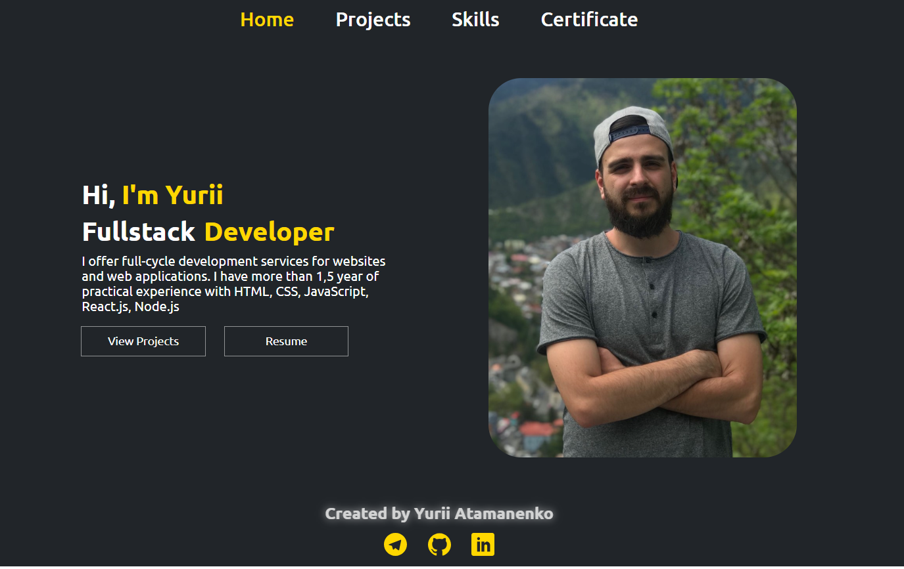

# PORTFOLIO | Yurii Atamanenko

I offer full-cycle development services for websites and web applications. I
have more than 1,5 year of practical experience with HTML, CSS, JavaScript,
React.js, Node.js

Live Page -
[yuriyatamanenko.github.io/Portfolio/](https://yuriyatamanenko.github.io/Portfolio/)

## Technologies Used

- React.js: JavaScript library for creating user interfaces;
- React-Router-Dom: Declarative routing for React web applications;
- @emotion/styled: Styling library for React components;

## Getting Started

To get started with this project, follow the installation instructions below.

## Installation

1. Clone the repository:

   git clone
   [https://github.com/YuriyAtamanenko/Portfolio.git](https://github.com/YuriyAtamanenko/Portfolio.git)

2. Install the dependencies:

   npm install

3. Start the development server:

   npm start
